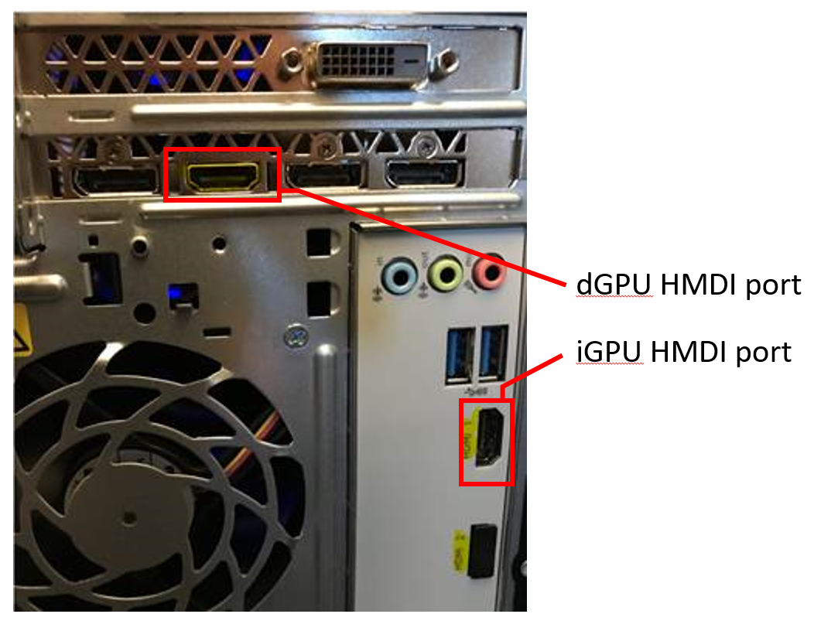

# Troubleshooting Windows Mixed Reality

## Installation and Setup

### I get a message that says my PC can’t run Windows Mixed Reality

If you get this message, your PC doesn’t meet the minimum requirements needed to run Windows Mixed Reality. This could be because the computer’s hardware setup isn’t compatible with Windows Mixed Reality, or because you need to update to the latest version of Windows.

Notes on graphics cards:
* If Windows Mixed Reality setup says your graphics card doesn’t meet the requirements and you think it does, make sure your headset is plugged into the correct card.
* Check with your graphics card manufacturer for the latest driver update. Windows Mixed Reality requires a graphics card driver that supports at least [WDDM 2.2.](https://en.wikipedia.org/wiki/Windows-Display-Driver-Model#WDDM-2.2)

### I get a message that says, "You’re nearly there—this PC doesn’t meet the minimum requirements needed to run Windows Mixed Reality"

If you get this message, your PC doesn’t meet the minimum requirements needed for the best experience in Windows Mixed Reality. Your PC may be able to run an immersive headset, but may not be able to run certain apps or might have problems with performance.

### We couldn't download the mixed reality software

If you are seeing the following screen, try the following troubleshooting steps:
1. Check your network connectivity. Your PC must be connected to the Internet to download Windows Mixed Reality.
2. Make sure your internet is not set as a Metered Connection by going to: **Settings > Network & Internet > Status > Change connection properties > Set as metered connection > Off**. See more details on Metered Connections [here](https://support.microsoft.com/en-us/help/17452/windows-metered-internet-connections-faq).
3. Make sure you don’t have any pending update by running **Settings > Windows Update > Check for Update**.
4. Make sure you have Windows Update enabled.
5. Restart your PC and try again.

**Note**: If you are on Enterprise managed network, and having issues downloading Mixed Reality Portal, it could be because your enterprise is using WSUS server, or have other policies that may block the download. Please check with your IT admin to make sure they enable the download for the enterprise.

### Setup is stuck on the "Hang tight while we do some downloading" page

Follow the guidance above in [We couldn't download the mixed reality software](troubleshooting-windows-mixed-reality.md#we-couldnt-download-the-mixed-reality-software).

### I get an error message when I try to create a boundary

Here are some guidelines for creating a boundary:
* Don't get too close to a wall or other obstruction
* Make sure to hold your headset at waist height, and face toward your computer while you trace the boundary
* Make sure the sensor isn’t blocked and there’s enough light
* The space you’re tracing should be larger than 3 square meters
* The space should not be too large or too complicated—stick to a simple geometric shape without a lot of twists and turns
* Don’t cross back over your own path as you’re tracing
* If you get stuck in a corner, start over

### My Xbox controller isn't working with Windows Mixed Reality

Try the following:
* Make sure your controller is turned on, fully charged, and connected to the PC.
* Replace the controller’s batteries.
* If you're using a Bluetooth controller, go to **Settings > Devices > Bluetooth & other devices** on your PC and make sure it's paired (you should see it listed on the page).

### I cannot direct input (controllers, gamepad, mouse/keyboard) into mixed reality

When you put on your headset, input should automatically get toggled to your mixed reality experience via your headset's presence sensor. You will know input is being directed to your headset because a blue bar will appear on your desktop like so:

If input doesn't get toggled automatically, you will need to manually toggle input to your headset. You can do this by typing **Windows Key + Y** on your keyboard (and the same to toggle input back to the Desktop)

### Learn Mixed Reality didn't run on first launch, and I went right into the Windows Mixed Reality home

You can re-run the learning experience by following the [re-run steps](learn-mixed-reality.md#how-do-i-re-run-the-learning-experience). 

### During start up of Mixed Reality, I'm stuck at the step "Turn your head side to side, and then at the floor"

You are asked to turn your head side to side so your headset can recognizing your space and restore the virtual floor and boundary you set up previously. When you put on your headset, this scanning process can take up to 10 seconds. After it is complete, you will either be in the Mixed Reality Home or you will be prompted to set up your boundary again.

If the scanning process takes longer than 10 seconds, there could be a problem with the proximity sensor in the headset:
1. Check that the sticker has been removed from the proximity sensor (the proximity sensor is located inside the headset roughly where the center of your forehead would be)
2. Check that your proximity sensor is toggling input to your headset: with your finger, cover and uncover the proximity sensor a few times to verify input is switching to the headset. You should see the **Windows Key + Y** banner at the top of your PC. You can manually switch input to the headset at any time by typing **Windows Key + Y** on your keyboard

## Windows Mixed Reality Home

### My controllers aren't showing in my Windows Mixed Reality Home

Make sure your controllers have full batteries and that they are paired correctly using Bluetooth. Try powering the controllers off and on using the Windows Button. If you still cannot see your controllers, try in-pairing and re-pairing each controller in the Settings menu under Devices > Bluetooth.

### The floor of my Windows Mixed Reality Home doesn't appear to be at the correct height, or it is slanted

If the floor of your Windows Mixed Reality Home doesn't feel like it's at the right height, open the Room Adjustment app from the start menu. This app will be launched once you place the app in the world. In this app, you will be directed to use the touch pad (motion controller) or direction pad (gamepad) to adjust the floor height. When the floor feels correct, use the Windows button to exit back to your Home.

### My headset has stopped tracking

Make sure the lights are turned on and that there isn't anything obstructing the inside-out tracking cameras on the front of your headset. If tracking is lost, it can take a few seconds for tracking to resume. If tracking does not resume, try restarting the Windows Mixed Reality Portal. See [Tracking Troubleshooting](troubleshooting-windows-mixed-reality.md#tracking-system) for more details.

### I cannot show a preview of what I'm seeing in my headset on my Desktop's screen?

Mixed Reality Portal has a **Play** button at the bottom of the screen that allows you to show a preview of what you're seeing in your headset on your desktop's screen. However, this feature is disabled on PCs with integrated graphics due to the load placed on the GPU

## HMD Connectivity

### The screen inside of my HMD is black

* Check to make sure that the HDMI cable is plugged in all the way
* If you're using extension cables, try removing them. 
* If you're using an HDMI adapter (e.g. a Mini DisplayPort to HDMI adapter), please try connecting the adapter to your PC before connecting the headset to the adapter. Make sure the adapter supports HDMI 2.0
* Check to make sure the USB cable is plugged into a USB 3.0 or faster port. USB 3.0 ports have SS (Super Speed) written next to them. They are often (but not always) colored blue.
* Try your PC's HDMI port with a PC monitor. Some PCs may have more than one HDMI port, and not all of them may be active
* If your PC has both an integrated graphics processing unit (iGPU) and a discrete graphics processing unit (dGPU), make sure that you are plugged into your dGPU's HDMI port. 

* Consult the Headset black screen troubleshooting flow chart below

### The screen inside of my HMD flickers, flashes or is black when using a Surface device
* Make sure you're using a compatible HDMI adapter
* Make sure your graphics driver is up-to-date

Not all Surface devices are compatible with Windows Mixed Reality.  Learn more about [Surface compatiblity and requirements](windows-mixed-reality-minimum-pc-hardware-compatibility-guidelines.md#windows-mixed-reality-and-surface) 

### My computer does not have an HDMI port

If your computer does not have an HDMI port, you will need to use a [supported and recommended HDMI to mini display port (DP) dongle](recommended-adapters-for-windows-mixed-reality-capable-pcs.md).

### Can I use an USB / HDMI extension cord with Windows Mixed Reality head mounted displays?
Windows Mixed Reality head mounted displays were not designed to work with extension cables. Use of extension cables with mixed reality head mounted displays is unsupported and use may impact your experience. 

### I am getting a "Check your display cable" error
* If you are using any adapters to connect your HMD to your PC, please make sure they support Windows Mixed Reality. Also try connecting the adapter to the PC, before connecting the HMD to the adapter.
* If your PC has both integrated and discrete graphics, make sure you're using the HDMI port on your active graphics card. In some cases, this may mean that you'll need to connect your PC display to a non HDMI port.
* Make sure your PC's HDMI port is working by trying to connect a PC monitor to it.
* Make sure your graphics drivers are up to date. Download and install the ones from AMD, Nvidia or Intel directly as they will likely * be newer than what's published to Windows Update.
* Make sure that you plugged your headset's HDMI cable into an **HDMI out** port on your PC, not an HDMI in port.

### I get a message that says "Connect your headset" even though I’ve plugged in my headset

Make sure your headset is connected to the correct ports on your computer:

1. Your headset's cable should be plugged into a USB 3.0 port. Try another USB 3.0 port if possible.
2. Your headset's HDMI cable should be plugged into your PC's discrete graphics card.

### Mixed Reality portal did not launch automatically after I plugged in my headset

If mixed reality portal did not launch automatically, you may need to install the driver for your headset manually.

Open up Device Manager (**Start > Device Manager**), look under **Other devices** for a **HoloLens Sensors** device with a yellow bang:

Right Click on the device and select properties. If the device's properties read **The drivers for this device are not installed (Code 28)** exit the window.

Right click on the device again and press **Update Drivers > Search automatically for updated driver software**

After the device updates, you should see a Mixed Reality Device appear in Device Manager:

**Note**:If you have an "N"-edition of Windows, you will need to upgrade to a regular edition of Windows to use Windows Mixed Reality. 

If manually installing the driver didn’t work, or you don't find it under Other Devices, then you probably need to uninstall the existing driver and reinstall it. 
* Open up Device Manager (**Start > Device Manager**), look under **Mixed Reality devices** for your HMD, it should appear normal and healthy, without a yellow bang.
* Right Click on the device and select **Uninstall Device**.
* In the new popup that appears, select the check box **Delete the driver software for this device** and this click **Uninstall**.
* When that completes unplug the HMD from your PC, and plug it back in. Windows Update will now download and install a new driver.

### Headset Troubleshooting Flowcharts

## I am getting a "Something Went Wrong" error code

| **Error Code**             | **Troubleshooting steps**                                          |
|----------------------------|--------------------------------------------------------------------|
| H0002000-0 | <ul><li>**Likely reason for the error code**: Your PC's operating system has gotten into a mismatched state for Windows Mixed Reality.</li><li>Please try checking Windows Updates for updates.</li></ul> |
| S0002261-101 | <ul><li>**Likely reason for the error code**: The HDMI adapter you are using is incompatible with Windows Mixed Reality.</li><li>Please see the supported and recommended HDMI to mini display port (DP) dongle [here](recommended-adapters-for-windows-mixed-reality-capable-pcs.md).</li></ul> |
| 2181038087-3 | <ul><li>**Likely reason for the error code**: The Mixed Reality headset failed to completely initialize. </li><li>**Troubleshooting**: This is most likely a transient error. Unplugging and re-plugging in your headset should resolve this issue. </li></ul>
| 2181038087-4 | <ul><li>**Likely reason for the error code**: The Mixed Reality headset driver failed to initialize the tracking cameras on your headset. </li><li>**Troubleshooting**: This is most likely a transient error. Unplugging and re-plugging in your headset should resolve this issue. </li></ul>
| 2181038087-5 | <ul><li>**Likely reason for the error code**: Windows Mixed Reality lost synchronization between the Mixed Reality camera frame timestamps and your PC timestamps. </li><li>**Troubleshooting**: This could be a transient error, or an indication of USB signal integrity issues. Try to unplug all of your USB devices, remove all extension cables, and plug in just your headset. </li></ul>
| 2181038087-7 | <ul><li>**Likely reason for the error code**: The Mixed Reality headset driver failed to initialize the firmware on your headset. </li><li>**Troubleshooting**: This is most likely a transient error. Unplugging and re-plugging in your headset should resolve this issue. Please also ensure that you are running the latest Windows Mixed Reality HMD driver. </li></ul>
| 2181038087-11 | <ul><li>**Likely reason for the error code**: Your CPU is too old to be compatible with Windows Mixed Reality. Your PC is failing the compatibility check because your CPU is missing the AVX instruction set required by the Mixed Reality motion controllers. </li><li>**Troubleshooting**: You'll need a Windows Mixed Reality compatible PC. You can find a list of Windows Mixed Reality badged PCs [here](https://www.microsoft.com/en-us/windows/view-all-devices?col=wmr-pcs#icons).</li></ul>
| 2181038087-12 | <ul><li>**One reason for the error code**: The HMD is plugged in to a USB port for which a non-Microsoft USB controller driver is installed and running.</li><li>**Troubleshooting**:</li><ol start="1"><li>Launch Device Manager (run devmgmt.msc).</li><li>Expand the category for Universal Serial Bus controllers.</li>Right click to uninstall the driver for each item that includes the text "eXtensible Host Controller" **and** does not have "Microsoft" in the name.</li><li>Check "Delete the driver software for this device" to ensure the old drivers are removed.</li><li>Check "Delete the driver software for this device" to ensure the old drivers are removed.</li><li>You are done when you verify that each item that includes the text "eXtensible Host Controller" has "Microsoft" at the end.</li><li>Now you should not see this error when you plug in the HMD.</li></ol></ul><ul><li>**A second reason for the error code**: The HMD is not properly responding to commands from the HMD driver. Unlike the previous reason this issue is intermittent.</li><li>**Troubleshooting**:</li><ol start="1"><li>Unplug the HMD for 30 or more seconds.</li><li>Plug it back in.</li></ol></ul> |
| 2181038087-13 | <ul><li>**Likely reason for the error code**: Windows Mixed Reality is unable to synchronize the Mixed Reality camera frame timestamps to your PC timestamps. </li><li>This is most likely caused by an incompatible USB Host controller. </li></ul> |
| 2181038087-14 | <ul><li>**Likely reason for the error code**: Windows Mixed Reality is having trouble initializing the presence sensor on your Mixed Reality headset. </li><li>**Troubleshooting**:</li><ol start="1"><li>Unplug your HMD and plug it back in.</li><li>Try another USB port.</li></ol></ul> |

## Motion Controllers

### My controller is stuck in an infinite reboot (buzzing after LEDs cycle) OR the controller doesn't turn on at all

Verify you have fresh batteries in the device. Controller buzzing 3 times and shutting down indicates critical battery. If the issue persists, perform [device recovery](troubleshooting-windows-mixed-reality.md#device-recovery) to reset the controller back to factory settings.

### I'm trying to pair my controllers, but they never show up in the "Add a new device menu" in Bluetooth Settings

Check that you do not have controllers paired already, remove them and try again. If problem persists reboot PC and try again.'' If that fails, consult the [Bluetooth Best Practices](troubleshooting-windows-mixed-reality.md#bluetooth-best-practices) section

### Wifi speeds becomes slow on my notebook when motion controllers are turned on

Your notebook may share Wifi antenna with Bluetooth when connected to 2.4GHz access point. Check from device manager if you can switch band preference to 5GHz. If 5GHz network is not available and performance is severely impacts consider using Bluetooth dongle.

### My second controller takes a long time to re-connect

Some older Intel radios experience this issue if motion controllers are powered on at the same time. To workaround this, do not power on controllers at the same time.

### Qualcomm Bluetooth radio cannot pair controllers after PC crash

Some Qualcomm (QCA) Bluetooth radios have issue where the device may end up in bad state after Windows crash. Workaround until driver fix is available is to power off the PC completely. This issue is fixed in QCA Bluetooth radio driver 10.0.0.448 or later. 

### Poor controller tracking with Marvell radio

Please ensure you have driver 15.68.9210.47 or later in use (**device manager->Bluetooth->Marvell AVASTAR Bluetooth Radio Adapter->Properties->Driver**) 

### Mixed Reality Portal is working, but motion controllers are tracking poorly (controllers keep flying away, shaking etc.)

Check the [Bluetooth Best Practices section](troubleshooting-windows-mixed-reality.md#bluetooth-best-practices) below. These symptoms are generally caused by failures to communicate between the controller and the host PC, which is indicative of poor Bluetooth link quality.

### Mixed Reality Portal is working, but motion controllers do not appear

Check the [Bluetooth Best Practices section](troubleshooting-windows-mixed-reality.md#bluetooth-best-practices) below. These symptoms are generally caused by poor Bluetooth link quality.

### Motion controllers firmware update takes significantly longer than 2 minutes

Check the [Bluetooth Best Practices section](troubleshooting-windows-mixed-reality.md#bluetooth-best-practices) below. These symptoms are generally caused by poor Bluetooth link quality.

### I just inserted fresh batteries but controller virtual battery level does not indicate full level

Motion controller battery level is tuned for AA batteries, some low voltage rechargeable batteries may not report full although being fully charged.

### My controller does not vibrate when battery is low

Haptics is disabled when battery level gets low, replace with fresh batteries to get rumble back.

### My device vibrated 3 times and then shutdown

Your batteries are running low and hitting cut-off threshold. Replace with fresh batteries.

### Device recovery

If the controller isn’t working correctly and you’re unable to update the device, you can always restore the device to factory conditions. To recover your device:
1. Unplug and power off the controllers.
2. Open the battery cover.
3. Insert batteries (ensure you have good batteries when performing device recovery).
4. Press and hold pairing button (tab at the bottom under the batteries).
5. While holding pairing button, power on the controller by pressing and holding the Windows button for 5 seconds (keep both buttons held).
6. Release buttons and wait for controller to power on. This takes up to 15 seconds and there are no indicators when device recovery is happening. If device powers on immediately on button release, recovery button sequence did not get registered and you need to try again.
7. Remove old controller associations from Bluetooth settings (**Settings->Bluetooth>other devices**, select **"Motion controller - Left"** or **"Motion controller - Right"** and **Remove device**. After that pair controller with PC again.
8. After connecting with host and HMD, device will update firmware to latest available.

### Lights and indicators

Motion controller uses LED constellation ring and haptics for indicating about its state.

| Motion controller state    | How you get into this state | Motion controller light and vibration behavior associated with state |
|----------------------------|-----------------------------|----------------------------------------------------------------------|
| **Power on**               | Press and hold Windows button on controller for 2s to turn on controller.       | LEDs turn on and controller vibrates once. |
| **Power off**              | Press and hold Windows button on controller for 4s to turn off controller.      | LEDs turn off and controller vibrates twice. |
| **Sleeping**               | Controller enters sleeping state automatically when it’s motionless for 30s.    Controller automatically wakes when it detects motion (except when device is not paired with host PC, button press will be required to wake-up). |LEDs turn off, blink every 3 seconds while in sleeping state. |
| **Pairing**                | Press and hold pairing button inside battery case for 3s.                       | LEDs slowly pulse while in pairing mode.    LEDs go solid when exiting pairing mode. Controller vibrates once if pairing was successful or vibrates 3 times if pairing is unsuccessful and times out. |
| **Controller connects to/disconnects from PC** | Controller successfully connects to PC after you turned it on.  Controller disconnects from PC during use for some reason.|Controller vibrates once on PC connection or disconnection. |
| **Low Battery Level**      | When battery level is low.|No LED or vibration indication when battery is low. If you look at the representation of the controller in headset, there is a battery indicator icon on the handle. When battery is low, the indicator icon will show 1/4 full. |
| **Critical Battery Level** | During power on when battery level is "Critical". "Critical" battery level means there is insufficient power for controller to stay on and the controller will turn off automatically.|Controller vibrates 3 times when you turn it on, then automatically turns off. As you approach this state, the battery indicator icon will display red. |

### Bluetooth best practices

Motion Controllers use the same Bluetooth technology found in many consumer devices. Motion Controllers are designed to work with Bluetooth capability included in any recent PC.

First verify that your PC has a Bluetooth radio. If the device passed the Mixed Reality Compatibility Checker then it should. Right click on the Windows Start Menu and select Device Manager. Expand the Bluetooth section and look for an adapter. If your PC doesn’t have Bluetooth, one recommended dongle is the [Plugable USB Bluetooth 4.0 Low Energy Micro Adapter](https://www.amazon.com/Plugable-Bluetooth-Adapter-Raspberry-Compatible/dp/B009ZIILLI/ref=sr-1-1?ie=UTF8&qid=1490148230&sr=8-1&keywords=plugable+broadcom).\
 

If your computer has Bluetooth already, but you are still having problems with the Motion Controllers, consider replacing your Bluetooth radio with the Plugable external Bluetooth Adapter plugged into USB.

**Note**: you can only have one Bluetooth radio adapter active at a time. if you plug in an external radio in addition to an existing radio you need to disable your existing Bluetooth radio in Device Manager (right click on the adapter and click Disable Device) and un-pair / re-pair all of your previous Bluetooth devices.

Motion Controllers should work with other Bluetooth keyboards, mice and game controllers, but the experience will vary depending on the model of keyboard, mouse or game controller you use.
* If you're using a USB Bluetooth Adapter:
<ul style="padding-left:20px">
  <li>Please ensure the USB Bluetooth Adapter is connected to a USB 2.0 port (black and doesn’t say SS) if available</il>
  <li>Please plug the USB Bluetooth Adapter into a port that is physically separated from:</il>
    <ul>
    <li>the HMD USB connector,</il>
    <li>flash drives,</il>
    <li>hard drives,</il>
    <li>or wireless USB receivers like those for keyboards/mice.</il>
    </ul>
  <li>Plugging the USB Bluetooth Adapter into the opposite side of the computer as far as possible from these other connectors is ideal.</il>
  <li>Do not install any 3rd party software</li>
  <li>Close the Bluetooth settings window if it's open. Leaving it open in the background means that a lot of extra calls are made to the Bluetooth protocol.</il>
  <li>If you are using an internal Bluetooth card, please ensure you are using an external Bluetooth antenna. No external Bluetooth antenna in this case is known to cause tracking issues. If this doesn’t work, please use an external Bluetooth dongle (USB) after disabling the internal Bluetooth.</il>
  <li>If direct line of sign to Bluetooth radio is problem or it is impossible to avoid interference close to the PC.</il>
  <li>It is important that the device appears under Mouse, Keyboard & Pen category in the Bluetooth settings. If under Other devices then unpair/pair.</il>
  <li>Please remove, un-pair and power off Bluetooth headphones and speakers. These are not supported with Windows Mixed Reality. You can use the headphone jack or built-in speakers on your Mixed Reality headset for the best audio experience.</il></ul>

### Motion Controller Troubleshooting Flowchart

**Motion Controllers Troubleshooting Steps:**

**Step A**: Make sure the motion controllers show up as 'Connected'. Just 'Paired' does not necessarily mean the controllers are connected to the PC. Controllers should appear under "Mouse, keyboard & pen" category. Motion controllers under "Other devices" have failed pairing process and is not functional.

**Step B**: If you're using an external USB Bluetooth Adapter:
* Please ensure the USB Bluetooth Adapter is connected to a USB 2.0 port (black) if available
* Please plug the USB Bluetooth Adapter into a port that is physically separated from:
* the headset USB connector,
* flash drives,
* hard drives,
* or wireless USB receivers like those for keyboards/mice.
* Plugging the USB Bluetooth Adapter into the opposite side of the computer as far as possible from these other connectors is ideal.

**Step C**: Verify there’s only one Bluetooth radio in the PC. Right click on the Windows Start Menu and select Device Manager. Expand the Bluetooth section and look for one Adapter. If you are using the desktop PC configuration with built-in radio, check if an external antenna is connected. If there isn’t an external antenna connected, it is expected to issues with tracking. Another option would be to use an external bluetooth dongle (USB), disable the internal Bluetooth capability and retry pairing and connecting.

**Step D & E**: Close the Bluetooth settings window if it's open. Leaving it open in the background means that a lot of extra calls are made to the Bluetooth protocol.

**Step F**: Check the virtual battery level on the motion controller - in mixed reality, turn the controllers over, and you'll be able to see a battery icon. If it is red, please go ahead and replace the batteries. Battery reporting typically reports higher than the actual level immediately after connecting a controller. Please wait around 15 seconds to let battery level to stabilize and then read the level.

**Step G**: Please power off Bluetooth headphones and speakers. These are not supported with Windows Mixed Reality. You can use the headphone jack or built-in speakers on your Mixed Reality headset for the best audio experience.

You can try a one-time workaround of unplugging the USB cable on your headset and plugging it back into the PC. This will restart the controller functionality on the PC.

**Step H**: Check if the motion controllers LEDs are brightly lit or dimly lit - brightly lit means that they are paired and connected. Dimly lit means that they aren't connected.

**Step I**: If the controller lights are flashing, they are undergoing a firmware update. Wait for the firmware update to complete and the controllers appear in Mixed Reality.

For laptops check if they are connected to 2.4GHz or 5GHz Wifi network. Laptops connected to 2.4GHz Wifi are typically sharing the same antenna with the Bluetooth connection. This may impact negatively either Wifi or Bluetooth performance, depending on product design. Options to resolve this include:
* Network adapter settings typically allow to change preferred band to 5Ghz
* If the user's network does not support 5GHz then a Bluetooth dongle can be used instead of the internal Bluetooth capability

Need to take account if user has paired earlier and Bluetooth settings have motion controllers already paired. Windows won’t discover new devices before those are removed. If those have been added using a specific dongle, they can be only removed with that dongle in place.

## Graphics Drivers

Windows Mixed Reality requires a WDDM 2.2 or later graphics driver in order to complete Mixed Reality setup.

If your PC does not already have a compatible graphics driver, please try these sources:
1. Check for the latest critical driver updates using Windows Update (**Start -> Windows Settings -> Update and Security -> Check for Updates**)
2. Check for the latest optional driver updates using Device Manager (Right-click **Start -> Device Manager** -> expand **Display Adapters** -> right-click on the graphics card, choose **Update Driver -> Search automatically for updated driver software**)
3. The website for the manufacturer (OEM) of your PC
4. The website for the manufacturer of the graphics card in your PC (e.g., AMD, Intel, NVIDIA)

**Note**: Recent graphics drivers tend to have performance and quality fixes for the latest content and experiences. If you are encountering performance problems with Mixed Reality, consider updating the graphics driver to the most recent version available for the graphics card in your PC.

### Graphics Driver Troubleshooting Flowchart

This flow chart below helps further explain the best steps to acquire a WDDM 2.2 or later graphics driver.

## Performance

### How do I tell if the Windows Mixed Reality HMD is rendering at 60Hz or 90Hz framerate?

The easiest way to check if WMR is running at 60 Hz or 90 Hz is to use the [Device Portal](https://docs.microsoft.com/en-us/windows/uwp/debug-test-perf/device-portal) -> Performance tab. 
The Headset display -> visual quality settings only affect the rendering of the WMR Home experience. If you have a discrete GPU with HDMI 2.0 ports and a CPU with 4+ Physical cores, you should be getting 90 Hz. If your GPU only has a HDMI 1.4 output, you can use a DisplayPort to HDMI 2.0 adapter as a workaround. 
[View the full list of recommended adapters here](https://holodocswiki.com/wiki/Recommended_adapters_for_Windows_Mixed_Reality_Capable_PCs) 

### What do I do if my PC appears to be running sluggish?

There are many reasons for the system to be sluggish. In most cases this will subside after a few seconds. However, if you are experiencing this over long periods of time, please ensure the following:
1. Close all un-used application on the Desktop.
2. Ensure that you have proper graphics drivers on our PC. (Please look at the Graphics drivers section.)
3. Ensure that your laptop is plugged into a power source.
4. Ensure that the PC is not warming up.
5. Lower visual quality in your Windows Mixed Reality Home.

### What do I do if my PC is warming up as I run MR experiences?

There are many reasons that a PC might warm up. Below are a few mechanisms to keep the PC running cool:
1. Ensure that the battery is charged and power source is plugged in.
2. Make sure that the fans that blow air into / out of PC are not blocked.
3. Use the PC in a relatively cool environment.
4. Make sure there are no heat sources (i.e. Sun, Heat vents, etc...) pointed at the PC.

## Tracking System

### The system cannot find the boundary and I'm being presented with setup UI

This means that the tracking system was unable to recognize your environment. If you are in a new environment, this is to be expected, please set up a bounds. If you have used the device in this environment in the past, and have previously set up a bounds here, then check the following:
* Make sure the room has enough light.
* Make sure you have worn the device and looked around the room. The device must observe your environment to know where it is. It will not find your bounds when it is sitting on a desk or table.
* Try unplugging the device, closing Windows Mixed Reality, and plugging the device back in.
* Something may have changed in your environment and the device no longer recognizes it. Try setting up a new boundary.

If these steps do not resolve the problem, then delete your environment data and re-setup your bounds.

### The system is presenting me with UI that asks me to choose setup for all experiences or seated/standing, and I see my bounds

This is caused by the device taking too long to find the bounds. You can bypass this message by choosing the option to use a boundary and you will be taken to your Windows Mixed Reality Home with your bounds present.

### I frequently see a message saying "I've lost my bounds"

This means that the tracking system is having a hard time tracking and identifying your environment. In this state, the device can no longer show you your bounds and to encourage you to not move around and accidently bump into things in the real world, you will be in 3DOF in the headset until the device can find your bounds again. Check the following:
1. Make sure the room has enough light.
2. If you have recently redecorated or remodeled the room, re-run setup.
3. Try unplugging the device, closing Windows Mixed Reality, and plugging the device back in.
4. Try clearing your environment data and re-setting up the device.
5. If this message persists, contact customer support.

### I can look around but I can't translate (stuck in 3DOF)

This means that the tracking system cannot generate pose, or the application has stopped using new pose data to render. Check the following:
* Make sure the room has enough light.
* Make sure the room has enough details to track
* Try unplugging the device, closing Windows Mixed Reality, and plugging the device back in.

If this message persists, contact customer support

### The view in the HMD is completely frozen

Typically, this means the application or a system level component has failed. Try the following.
1. Press the "home" button to leave the application.
2. Unplug the device, close MRP and plug the device back in.
3. Reboot the PC.

### I frequently see a black border around the edges of the view in the HMD. Sometimes it looks like I'm looking down a tunnel

This means that the application is not able to hit frame rate on your PC and the system is having to use old frames to render the view in the HMD. Since applications only render the part of the world you are looking at, if they do not consistently hit their frame rates, then the system will attempt to continue to render the world from a previous point of view and will fill in the missing details with black. If this happens frequently, Check the following:
1. Close or terminate all unneeded programs to free up memory and CPU.
2. Reduce detail settings in your application.
3. Reduce detail settings in Windows Mixed Reality settings.

### The view in the HMD is jittering and stuttering a lot

There are several reasons this may happen. The primary causes are the system not being able to render content to the headset, or the tracking system is experiencing problems. Check the following:
1. Make sure your PC is not under resource contention. Open Task Manager and ensure your compute resources are free (e.g. 80% CPU free, 400MB of ram and disk IO is below 80%).
2. Make sure you have the latest graphics drivers for your hardware. See the graphics drive section for more info.
3. Make sure the room has enough light.
4. Try unplugging the device, closing Windows Mixed Reality, and plugging the device back in.
5. Try rebooting your PC.

If this problem persists, contact customer support.

### The world briefly froze and perhaps tilted or flipped upside before returning to normal

This could be caused by an app or system level component hitting a fatal error, or a temporary lack of memory or CPU resources. Check the following:
1. Open task manager and ensure you have at least 20% CPU free and 400MB memory free (e.g. 80% CPU free, 400MB of ram and disk IO is below 80%).
2. Check to see if any processes crashed. Open event viewer, navigate to Windows Logs -> Application and Error level event entries around the time of the brief freeze that would indicate a process crashed.
3. Try rebooting the PC if this problem persists.

### The world flipped upside down momentarily and returned to normal

This is typically caused by errors in obtaining sensor data from the headset to inform the tracking algorithms. If this happens frequently, try the following:
1. Plug the headset into a different USB 3.0 port.
2. Plug the headset directly into the PC rather than a USB 3.0 hub.

If this problem persists, contact customer support.

### The world is tilted but I can navigate and walk around fine in Windows Mixed Reality

This is typically caused by errors in sensor data being recorded into the environment data that is stored on your PC. This can cause the Windows Mixed Reality to appear tilted, sometimes permanently. Try the following:
1. Unplug the HDM, close Windows Mixed Reality and plug the headset back in.
2. Reboot the PC.
3. Clear your environment data.

## WebVR

### Why can’t I see my controllers when viewing VR content from Edge?

Not all WebVR content is authored to support motion controllers. WebVR allows developers of content to support different types of input, such as game controllers or motion controllers. If you do not see your controllers on a site, it likely doesn’t have motion controller support.

### Why can't I use the mouse in an immersive WebVR view?

Not all WebVR content is authored to support mouse input.

This is an optional feature of the WebVR specification; not all browsers support this feature.

WebVR allows developers of content to support different types of input, such as mouse, keyboard, game controllers or motion controllers. Mouse input behavior varies per browser. Within Microsoft Edge, website authors must ensure they take 'pointerlock' when presenting to the headset for mouse input to work.

### Why does my controller look like a Vive/Oculus, has strange orientation, or the buttons are incorrectly mapped?

This website likely doesn’t have full motion controller support.

### Why can’t I view 360 degree videos from Youtube/Facebook/Vimeo/The Guardian/New York Times etc. from Edge in VR?

Just like any other web specification or standard, the author has the choice about whether or not they implement it. There is a WebVR specification that allows websites to launch VR experiences directly from the browser; these authors of these websites have not implemented this specification at this time. There may be downloadable apps on some platforms that enable viewing of VR content from these vendors.

### Why can’t I enter VR from Firefox or Chrome?

WebVR is only supported by Windows Mixed Reality devices in Edge at this time.

### When I enter VR from a website, why do I see a blank screen in my headset?

It is possible that the website has not implemented support for Multi GPU machines (including Hybrid GPU laptops). Things to try:
* Reloading the page may help.
* On desktop machines, try plugging the headset in to the same graphics adapter as the monitor that is displaying Microsoft Edge. (Try to plug both into the higher powered graphics card, not the integrated graphics adapter)

### When I exit VR when watching a video from Edge, the sound continues playing but the Edge window is grayed out

This is a known issue when running WebVR from Edge in the Mixed Reality cliffhouse. The workaround is as follows:
* Rather than pressing the windows button to exit the WebVR experience, press escape on the keyboard.
* Alternatively, activate the greyed out Edge window by selecting it, then stop the video playing.

### Can I use WebVR on the HoloLens?

Microsoft has not announced anything about WebVR on the HoloLens at this point.

### Why is my view at floor level when viewing WebVR content from Edge?

This website does not properly support Windows Mixed Reality headsets. To work around this:
1. Place the headset on the floor of your space.
2. Navigate to the WebVR page using Microsoft Edge on your desktop (not within Mixed Reality).
3. Click the button on the webpage to Enter VR.
4. Wait 5-10 seconds (for the experience to fully enter immersive mode).
5. Pick up the headset, and place on your head.

### The display is very low resolution in some WebVR experiences

This website does not properly support high resolution headsets. To workaround this, some things that may work:
* If launching WebVR from the desktop (as opposed to from within the Mixed Reality cliffhouse), ensure the window is maximized prior to Entering VR.
* Avoid resizing the Microsoft Edge window after you have entered VR.

### Why does the WebVR immersive view exit when I change browser tabs?

This is expected behavior. For security reasons, only the active browser tab can access connected headsets.

### Why can't I hear audio on a particular WebVR experience?

The website may be using the OGG audio file format, which Microsoft Edge does not currently support.

You can report broken sites directly to the Microsoft Edge browser team in the [issue tracker](https://developer.microsoft.com/en-us/microsoft-edge/platform/issues/), or via twitter using [#EdgeBug hashtag](https://blogs.windows.com/msedgedev/2016/08/11/edgebug-twitter/).

### Why does Haptic feedback not work in WebVR with motion controllers?

Microsoft Edge does not currently support haptics on the WebVR gamepad API extensions.

## SteamVR

### I get a message that says “To use SteamVR with Windows Mixed Reality, you need to install the latest Windows Update." or "Windows Developer Mode Required"
1. Make sure your PC is running the latest version of Windows 10. To check this, go to Settings  > System > About. Under Windows specifications, make sure OS Build is 16299.64 or greater.
2. Make sure you don’t have any updates waiting to download or install. Go to Settings  > Update & Security > Windows Update, and select Check for updates. You may have to check for updates multiple times so keep checking for updates until no further updates are available and then restart your PC.

### My controllers aren't working as expected
1. Close SteamVR.
2. Return to the Mixed Reality Home and confirm that your controllers are working as expected.
3. Launch the SteamVR experience again and your controllers should be back to normal.
4. If issues persist please file feedback using the Windows Feedback Hub under the Mixed Reality category and include SteamVR in the summary.

### My games are running slowly
1. Confirm that your PC meets the specifications for the SteamVR game you are playing.
2. In Mixed Reality Portal on your desktop, select Pause to stop desktop preview.
3. Follow the instructions above to make sure you are running Windows 10 build 16299.64 or later.
4. Make sure your PC has the latest graphics drivers.
5. Check Task Manager to see what other processes might be running on your PC and consuming resources.
6. Check to see if Steam is downloading a game in the background. This can consume resources and make games run poorly.
7. There is a known performance issue that affects a small class of apps that do not have a visible window. The primary example of this is SteamVR Home. While the vast majority of apps do not fall into this category, a fix will be available in a future update.

If you're still running into unexpected performance issues, send us feedback using the Windows Feedback Hub. Make sure to follow the instructions to [include a SteamVR Performance Trace](using-steamvr-with-windows-mixed-reality.md#sharing-feedback-on-steamvr). 

### SteamVR is showing a compositor error (e.g. Shared IPC Compositor Connect Failed (400))
There is a known issue where this can happen if your headset and primary monitor are on two different video adapters. To work around, attach your monitor to the same adapter as your headset and configure that monitor to be the primary using **Settings app -> System -> Display**

### SteamVR content appears in the wrong place (e.g., beneath the floor or above my head)
Try this to reset your position: 
1. Click the left controller's thumbstick to bring up the **SteamVR Dashboard**
2. Click the **Settings** button
3. Click **Reset Seated Position**

## Speech and Audio

### I can't hear any sound in my headset, or sound is playing through my computer

If your immersive headset doesn’t include built-in headphones, you’ll need to connect headphones to the audio jack on the headset. (The jack is often located just behind the headset visor or lenses; check with your headset manufacturer if you have trouble finding it.)

Some audio headsets have physical buttons to control the volume. If audio isn't working, check to see whether the volume is turned down or muted.

Windows Mixed Reality is designed to play sound through your immersive headset when you’re wearing it and have headphones connected to it. When you take the headset off or flip the visor up, audio will switch to your default Windows playback device. You can change this setting in **Settings > Mixed reality > Audio and speech.**

Other troubleshooting steps:
* Make sure your audio headset is plugged into the audio jack completely - the Acer headset in particular may require more care to ensure the audio headset is plugged in all the way.
* Check that the audio headset/mic is plugged into the headset and not the PC.
* The Windows Sound Control Panel shows a list of enabled audio endpoints. It does not by default show disabled endpoints. The headset audio device will be disabled when you're not wearing the headset, so you have to right-click in the sound control panel and choose "Show disabled devices" to see it; the device name is "Realtek USB2.0 Audio". Once you do this, you can change the friendly name in the "Properties" page to something you'll recognize more easily. Do this for both the playback and recording tabs.
* If your audio is not working in Mixed Reality apps (for example Netflix), this may be caused by a known issue where Windows Mixed Reality is not be automatically updated to match the OS version. To fix this issue and get the best Mixed Reality experience, go to **Settings -> Update & Security -> Windows Update -> Check for Updates**.

### I'm experiencing sudden volume changes, lost audio, or buzzing

Some applications, including many of those launched through SteamVR, can lose audio or hang when the audio device changes as you start or stop the Mixed Reality Portal. Restart the app after you have opened the Mixed Reality Portal app to correct this.

When another multimedia USB device (such as a web cam) shares the same USB hub (either external or inside your PC) with the Windows Mixed Reality headset, in rare cases the headset's audio jack/headphones may either have a buzzing sound or no audio at all. You can fix this by plugging your headset into a USB port that does not share the same hub as the other device, or disconnect/disable your other USB multimedia device.

In very rare cases, the host PC's USB hub cannot provide enough power to the Windows Mixed Reality headset and you may notice a burst of noise from the headphones connected to the headset.

### My Bluetooth audio headset isn't working as expected

Bluetooth audio peripherals do not work well with Windows Mixed Reality voice and spatial sound experiences. They can also negatively affect your motion controller experience. We do not recommend using Bluetooth Audio headsets with Windows Mixed Reality.

### Sound is or isn't coming from expected directions

The Windows Mixed Reality home includes spatial sound simulation, where audio from apps you've placed in your home sounds like it's coming from the location of those apps. As you turn around, and move closer or farther from each app, the sound direction and level will change, just like in real life. This change in audio isn't a bug, it's designed to further the sense of realism.

Additionally, when you open and play music from a background-capable music app (like Groove Music) in your Windows Mixed Reality home and then open an immersive VR experience (like a game) the sound from the music app will crossfade from spatial sound to stereo. It may appear louder than before because the distance between you and the sound is now zero.

If you have Cortana enabled on your host PC prior to using your Windows Mixed Reality headset, you may lose the spatial sound simulation applied to the apps you place around the Windows Mixed Reality home. The work around is to enable "Windows Sonic for Headphones" on all the audio devices attached to your PC, even your headset-connected audio device:
1. Left-click the speaker icon on the desktop taskbar and select from list of audio devices.
2. Right-click the speaker icon on the desktop taskbar and select "Windows Sonic for Headphones" in the "Speaker setup" menu.
3. Repeat these steps for all of your audio devices (endpoints).
* **Note:** Because the headphones/speakers connected to your headset won't appear unless you're wearing it, you have to do this from within the Desktop app window in the Windows Mixed Reality home to apply this setting to the audio device connected to your headset (or integrated into your headset).
* **Note:** Another option is to turn off "Let Cortana respond to Hey Cortana" in **Settings** > **Cortana** on your desktop prior to launching Windows Mixed Reality.

### Speech commands are not working as expected

To use speech commands, your PC’s speech and language settings must be set to one of the languages supported in Windows Mixed Reality. To check this, go to **Settings > Time & language > Region & language and Settings > Time & language > Speech.** Dictation will not work correctly if your system keyboard language does not match the language you've selected for Windows Mixed Reality.

If your headset doesn’t have a built-in mic, you’ll need to attach headphones with a mic to the headset or to your PC. To have mic input switch automatically to your headset when you wear it, go to **Settings > Mixed reality > Audio and speech**, and make sure that "When I wear my headset, switch to headset mic" is turned on.

Audio headsets with a microphone that dangles from the earbud cable do not perform well for voice commands in environments with ambient noise.

Some audio headsets have a physical button to mute and unmute the microphone. If speech commands aren't working, check to see whether your mic is muted.

Cortana can be slow the first time she is invoked in a Mixed Reality Portal session. You can work around this by making sure "Let Cortana respond to Hey Cortana" under **Settings** > **Cortana** > **Talk to Cortana** is enabled.

On some PCs, the default voice capture gain for your headset-connected microphone may be set too low. If you experience unreliable speech commands or dictation, you can try running the Microphone Setup troubleshooter. You can reach this troubleshooter through the **Settings** > **Time & Language** > **Speech**, then click "Get Started" in the "Microphone" section. To affect the microphone you use for Windows Mixed Reality, you have to do this through the Desktop app in the Windows Mixed Reality home while wearing the headset. Select the appropriate endpoint in the troubleshooter wizard.

### I only have one audio headset and I want to use it for both Desktop and my headset

There is no way to use the audio device connected to (or part of) the headset for audio playback when the device is not worn. If you only have one audio headset and not an headset with built in headphones, you may want to connect the audio headset to the host PC instead of the headset. Then you must turn off "switch to headset audio" in the MRP settings.

## Accessing your Desktop in Mixed Reality

### Desktop App
You can access your PC desktop in Mixed Reality using the Desktop app. You can launch Desktop app in the headset from **Windows Button > All apps > Desktop** 

### Using Desktop app with Multiple Monitors
By default, Desktop app automatically switch to display the monitor with focus. 
If you wish to see all of your monitors in Mixed Reality, follow steps below: 
* Click the monitor icon on the top left corner of the app
* Disable "Automatically Switch Monitor"
* Pick the monitor you wish to see
* Launch another instance of the Desktop app
* Pick the monitor you wish to see on that instance 
* Repeat for as many physical monitors as you have. 
Please note that you will have to re-pick which monitor to show on each Desktop app every time you restart Mixed Reality. 

### Desktop apps showing Black Screen
If the Desktop app shows only a black screen, and your PC has Nvidia hybrid GPU, the issue may be caused by Nvidia device running the runtimebroker.exe on the discrete GPU instead of the integrated one. To fix this issue, follow these instructions under "[How do I create Optimus settings for a new program?](http://nvidia.custhelp.com/app/answers/detail/a_id/2615/~/how-do-i-customize-optimus-profiles-and-settings%3F)" to add C:\windows\system32\runtimebroker.exe and force it to run on the "Integrated graphics" processor. 

## Uninstalling Mixed Reality
You can uninstall Windows Mixed Reality from **Settings -> Mixed Reality -> Uninstall**. 
If you uninstall Windows Mixed Reality and then see a message that says "We couldn't finish uninstalling Windows Mixed Reality," here's what to do. 
**Note**: This section is intended for advanced users. It involves modifying the registry and using Windows PowerShell to run commands. If you modify the registry incorrectly, serious problems might occur. Make sure to follow these steps carefully. For added protection, back up your registry before you modify it. Then, you can restory the registry if a problem occurrs. For more info, see How to back up and restory the registry in Windows. 

1. Restart your PC.
2. In the **Search** box, type "regedit" and then select **Yes**.
3. Remove the following registry values:
<ul>
    <li><b>HKEY_CURRENT_USER\Software\Microsoft\Windows\CurrentVersion\Holographic</b>, then delete <b>FirstRunSucceeded</b>.</li> 
    <li><b>HKEY_CURRENT_USER\Software\Microsoft\Windows\CurrentVersion\Holographic\SpeechAndAudio</b>, then delete <b>PreferDesktopSpeaker</b> and <b>PreferDesktopMic</b>.</li> 
    <li><b>HKEY_CURRENT_USER\Software\Microsoft\Speech_OneCore> Settings\Holographic</b>, then delete <b>DisableSpeechInput</b>. Note:the registry items in HHKEY_CURRENT_USER must be deleted for every user account on the PC that has used Windows Mixed Reality.</li> 
    <li><b>HKEY_LOCAL_MACHINE\Software\Microsoft\Windows\CurrentVersion\PerceptionSimulationExtensions</b>, then delete <b>DeviceID</b> and <b>Mode</b>.</li> 
    <li><b>HKEY_CURRENT_USER\Software\Microsoft\Windows\CurrentVersion\Holographic</b>, then delete <b>OnDeviceLearningCompleted</b>.</li> 
</ul>

4. Remove the following registry keys: 
<ul>
  <li> <b>HKEY_CURRENT_USER\Software\Microsoft\Windows\CurrentVersion\HoloSI</b></li> 
  <li> <b>HKEY_LOCAL_MACHINE\Software\Microsoft\Windows\CurrentVersion\HoloSI</b></li> 
  <li> <b>HKEY_CURRENT_USER\Software\Microsoft\Speech_OneCore\Settings\HolographicPreferences</b></li>  
</ul>

5. Close Registry Editor.

6. Navigate to **C:\Users\user name\AppData\Local\Packages\Microsoft.Windows.HolographicFirstRun_cw5n1h2txyewy\LocalState**, and then delete **RoomBounds.json**. Repeat this for each user who has used Windows Mixed Reality.

7. Open admin cmd prompt and navigate to **C:\ProgramData\WindowsHolographicDevices\SpatialStore\HoloLensSensors**. Then delete the contents of the **HeadTracking data** folder (but not the folder itself).

8. Type "powershell" in the **Search box**, right-click **Windows PowerShell**, and then select **Run as administrator**.

9. In Windows PowerShell, do the following:
<ul>
  <li>Copy and paste the following at the command prompt, then press Enter: <b>Dism /online /Get-Capabilities</b></li> 
  <li>Copy the Capability Identity that begins with Analog.Holographic.Desktop (if it isn't there, that means this item isn't installed. In that case, skip to step 10 ).</li> 
  <li>Copy and paste the following command prompt, then press Enter: <b>Dism /online /Remove-Capability /CapabilityName:the Capability Identity copied in the last step</b></li>
</ul>

10. Restart your PC.

